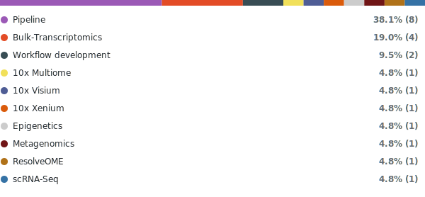

# Dartmouth Data Analytics Core 

The **GDSC** aims to facilitate advanced bioinformatic, computational, and statistical analysis of complex genomics data for the Dartmouth research community.  

## Project Master List

Core Development

  
| Project | Modality | Repo | Date|
|----------|-----------|------|----|
|miRNA-pipeline-comparison| workflow development| [Github](https://github.com/Dartmouth-Data-Analytics-Core/miRNA-pipeline-comparison)| 11/21/2025 |

Core Pipelines

  
| Project | Modality | Repo | Date|
|----------|-----------|------|----|
| DAC-RNAseq-pipeline | Pipeline| [Github](https://github.com/Dartmouth-Data-Analytics-Core/DAC-RNAseq-pipeline)| 11/12/2019 |
| GDSC-clover-Seq | Pipeline | [Github](https://github.com/Dartmouth-Data-Analytics-Core/GDSC-clover-Seq) | 10/22/2025 |
| GDSC-MGX-Pipeline | Pipeline | [Github](https://github.com/Dartmouth-Data-Analytics-Core/GDSC-MGX-Pipieline) |10/2/2025 |
| GDSC-HyperTRIBE-pipeline | Pipeline | [Github](https://github.com/Dartmouth-Data-Analytics-Core/GDSC-HyperTRIBE-pipeline) | 4/25/2025 |
| DAC-Barcode-Seq-pipeline | Pipeline | [Github](https://github.com/Dartmouth-Data-Analytics-Core/DAC-Barcode-Seq-pipeline) | 3/26/2025 |
| DAC-BulkATAC-Seq-pipeline | Pipeline | [Github](https://github.com/Dartmouth-Data-Analytics-Core/DAC-BulkATAC-Seq-pipeline) | 4/4/2025 |
| DAC-WES-pipeline | Pipeline | [Github](https://github.com/Dartmouth-Data-Analytics-Core/DAC-WES-pipeline) | 3/5/2025 |

Dunlap

  
| Project | Modality | Repo | Date|
|----------|-----------|------|----|
|250708-dunlap-atac| Epigenetics| [Github](https://github.com/Dartmouth-Data-Analytics-Core/250708-dunlap-atac)| 07/08/2025 |

Fiering

| Project | Modality | Repo | Date |
|----------|-----------|------|------|
| 250916-Fiering-DGE | RNA-Seq | [GitHub](https://github.com/Dartmouth-Data-Analytics-Core/250916-Fiering-DGE) | 09/16/2025 |

Godek

| Project | Modality | Repo | Date |
|----------|-----------|------|------|
| 251014_godek_resolveOME | ResolveOME | [GitHub](https://github.com/Dartmouth-Data-Analytics-Core/251014_godek_resolveOME) | 10/14/2025 |

Goods

| Project | Modality | Repo | Date |
|----------|-----------|------|------|
| 251006_DNASeq_goods | MGX | [GitHub](https://github.com/Dartmouth-Data-Analytics-Core/251006_DNAseq_goods) | 10/06/2025 |

Kasper

| Project | Modality | Repo | Date |
|----------|-----------|------|------|
| kasper_250613_10x_multiome | 10x multiome | [GitHub](https://github.com/Dartmouth-Data-Analytics-Core/kasper_250613_10x_multiome) | 06/13/2025 |

Leib

| Project | Modality | Repo | Date |
|----------|-----------|------|------|
| 20250306-Leib-HSV1-Multiomics | RNA-Seq, Visium | [GitHub](https://github.com/Dartmouth-Data-Analytics-Core/20250306-Leib-HSV1-Multiomics) | 03/06/2025 |

Malaney

| Project | Modality | Repo | Date |
|----------|-----------|------|------|
| 250922-Malaney-Colon-Cell-line-DEGs | RNA-Seq | [GitHub](https://github.com/Dartmouth-Data-Analytics-Core/250922-Malaney-Colon-Cell-line-DEGs) | 09/22/2025 |

Pioli

| Project | Modality | Repo | Date |
|----------|-----------|------|------|
| 241105_pioli_scRNASeq |scRNA-Seq | [GitHub](https://github.com/Dartmouth-Data-Analytics-Core/241105_pioli_scRNAseq) | 11/05/2024 |

Sundrud

| Project | Modality | Repo | Date |
|----------|-----------|------|------|
| 251123-Sundrud-BarcodeSeq-Dev | workflow development  | [GitHub](https://github.com/Dartmouth-Data-Analytics-Core/251123-Sundrud-BarcodeSeq-Dev) | 11/23/2025 |

Turk

| Project | Modality | Repo | Date |
|----------|-----------|------|------|
| 250625_Turk_xenium | Xenium | [GitHub](https://github.com/Dartmouth-Data-Analytics-Core/250625_Turk_xenium) | 06/25/2025 |

Zhang

  
| Project | Modality | Repo | Date|
|----------|-----------|------|----|
|251028-Zhang-RNA-seq| RNA-Seq| [Github](https://github.com/Dartmouth-Data-Analytics-Core/251028-Zhang-RNA-seq)| 10/28/2025 |

<!-- START: modality-counts -->

### Modality Distribution

  

View as table

| Modality | Count |
|----------|-------|
| Pipeline | 7 |
| Bulk-Transcriptomics | 4 |
| Workflow development | 2 |
| 10x Multiome | 1 |
| 10x Visium | 1 |
| 10x Xenium | 1 |
| Epigenetics | 1 |
| Metagenomics | 1 |
| ResolveOME | 1 |
| scRNA-Seq | 1 |

<!-- END: modality-counts -->

